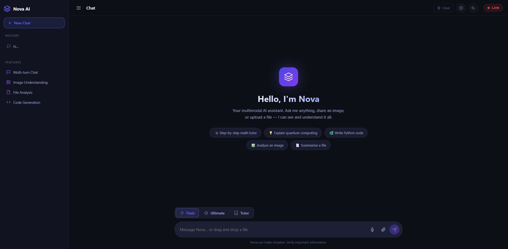

🌌 Nova AI: High-Performance Multimodal Assistant
Built for the Gemini API Developer Competition 2026;

Nova AI built by Sonip of Haldia,West Bengal,India.
Nova AI is a low latency,multimodal AI ,powered by Gemini 2.0/2.5/3.0/2.5-flash-native-audio-latest.IT bridges the gap between reality and the reasoning power of Gemini.It's main focus is speed,precision,user-interactivity.

🚀 Key Features
Text answers for speed: Uses the Gemini 2.5/3.0 flash to power the beginning of every ideas that shine.
Toggles between Flash and Ultimate: